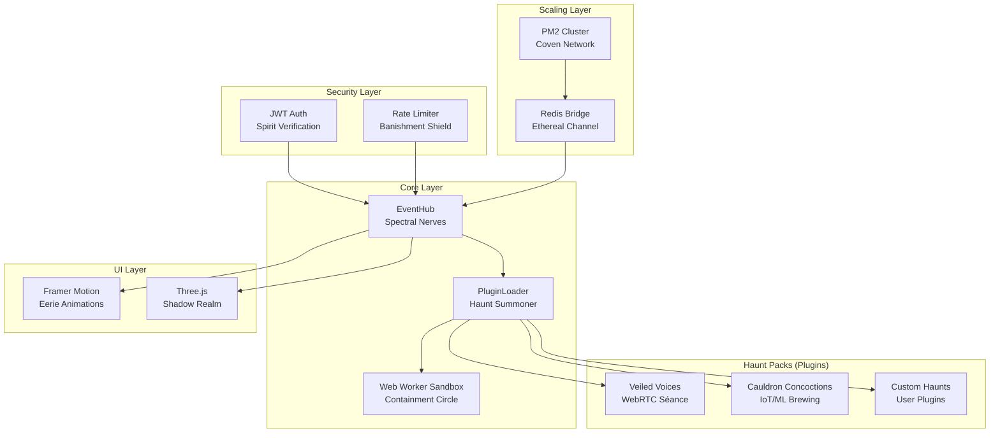

# Phantom Framework Design Document

## Overview

The Phantom Framework is a reactive, plugin-based TypeScript framework designed for simulation-heavy applications with Halloween-themed aesthetics. The architecture centers around "spectral nerves" (RxJS streams) that orchestrate events through an EventHub, while "haunt packs" (plugins) provide modular functionality with unpredictable, spooky behaviors.

The framework follows a layered architecture with clear separation between core functionality, security, scaling, and application-specific features. Two demonstration applications showcase the framework's capabilities: Veiled Voices (WebRTC audio séance) and Cauldron Concoctions (IoT/ML potion brewing).

## Architecture



## Components and Interfaces

### Core Components

#### EventHub (Spectral Nerves)
The central nervous system of the framework, extending RxJS Subject to orchestrate all events.

```typescript
interface IEventHub extends Subject<any> {
  processStream<T>(input$: Observable<T>, fn: (data: T) => Observable<any>): Observable<any>;
  fuseStreams<T>(...streams: Observable<T>[]): Observable<T[]>;
  select<T>(key: string): Observable<T>;
  getState<T>(key: string): T | undefined;
  setState<T>(key: string, value: T): void;
}
```

#### PluginLoader (Haunt Summoner)
Dynamically loads and manages plugin lifecycle with retry mechanisms and security validation.

```typescript
interface IPluginLoader {
  loadManifest(manifestPath: string): Promise<PluginManifest>;
  loadPlugin(pluginConfig: PluginConfig): Promise<IPlugin>;
  initializePlugin(plugin: IPlugin, hub: IEventHub): Promise<void>;
  teardownPlugin(pluginId: string): Promise<void>;
  retryLoad(pluginConfig: PluginConfig, maxRetries: number): Promise<IPlugin>;
}
```

#### Plugin Interface (Haunt Pack Contract)
Standard interface that all plugins must implement for framework integration.

```typescript
interface IPlugin {
  readonly id: string;
  readonly manifest: PluginManifest;
  
  init(hub: IEventHub): Promise<void>;
  process(event: any): Observable<any>;
  teardown(): void;
  
  // Optional spooky behaviors
  haunt?(): Observable<any>;
  manifest_disturbance?(): boolean;
}
```

### Security Components

#### JWT Authentication (Spirit Verification)
Middleware for verifying user tokens and managing session security.

```typescript
interface IAuthService {
  verify(token: string): Promise<UserClaims>;
  generateToken(user: User): string;
  refreshToken(refreshToken: string): Promise<string>;
  validateRole(user: UserClaims, requiredRole: Role): boolean;
}

enum Role {
  USER = 'user',
  MODERATOR = 'moderator',
  ADMIN = 'admin'
}
```

#### Rate Limiting (Banishment Shield)
Express middleware preventing abuse with configurable limits.

```typescript
interface IRateLimiter {
  createLimiter(windowMs: number, maxRequests: number): RequestHandler;
  isBlocked(identifier: string): boolean;
  getRemainingRequests(identifier: string): number;
}
```

### Scaling Components

#### Cluster Management (Coven Network)
PM2-based horizontal scaling with process management.

```typescript
interface IClusterManager {
  startCluster(instances: number): Promise<void>;
  stopCluster(): Promise<void>;
  getClusterStatus(): ClusterStatus;
  broadcastToWorkers(message: any): void;
}
```

#### Redis Bridge (Ethereal Channel)
Inter-process communication using Redis pub/sub for distributed events.

```typescript
interface IRedisBridge {
  publish(channel: string, message: any): Promise<void>;
  subscribe(channel: string, handler: (message: any) => void): Promise<void>;
  unsubscribe(channel: string): Promise<void>;
  getSubscribers(channel: string): string[];
}
```

## Data Models

### Plugin Manifest
Configuration structure for plugin loading and metadata.

```typescript
interface PluginManifest {
  plugins: PluginConfig[];
  version: string;
  author?: string;
  description?: string;
  spookiness_level?: 'mild' | 'moderate' | 'terrifying';
}

interface PluginConfig {
  id: string;
  path: string;
  class: string;
  dependencies?: string[];
  permissions?: Permission[];
  haunt_probability?: number; // 0-1 for unpredictable behaviors
}
```

### Event Models
Standardized event structures for framework communication.

```typescript
interface SpectralEvent {
  type: string;
  timestamp: number;
  source: string;
  data: any;
  metadata?: {
    haunted?: boolean;
    intensity?: number;
    origin_realm?: string;
  };
}

interface StreamState {
  key: string;
  value: any;
  lastUpdated: number;
  subscribers: number;
  is_cursed?: boolean;
}
```

### Demo Application Models

#### Veiled Voices Models
```typescript
interface AudioPeer {
  id: string;
  connection: RTCPeerConnection;
  audioTrack?: MediaStreamTrack;
  role: 'medium' | 'participant' | 'spirit';
  sentiment_score?: number;
}

interface SéanceSession {
  id: string;
  participants: AudioPeer[];
  ai_haunts: AIHaunt[];
  active_rituals: string[];
  atmosphere_level: number; // 0-1
}

interface AIHaunt {
  id: string;
  personality: 'mischievous' | 'melancholy' | 'malevolent';
  voice_model: string;
  interruption_probability: number;
  last_manifestation: number;
}
```

#### Cauldron Concoctions Models
```typescript
interface SensorReading {
  sensor_id: string;
  type: 'temperature' | 'humidity' | 'ph' | 'mystical_energy';
  value: number;
  timestamp: number;
  location: string;
  anomaly_score?: number;
}

interface PotionRecipe {
  id: string;
  ingredients: Ingredient[];
  brewing_steps: BrewingStep[];
  predicted_effects: Effect[];
  genetic_fitness: number;
  lineage: string[]; // parent recipe IDs
}

interface Ingredient {
  name: string;
  quantity: number;
  unit: string;
  rarity: 'common' | 'rare' | 'legendary';
  magical_properties: string[];
}
```

## Error Handling

### Spectral Error Management
The framework implements a multi-layered error handling strategy with spooky terminology.

#### Error Categories
- **Manifestation Errors**: Plugin loading and initialization failures
- **Disturbance Errors**: Stream processing and event handling errors  
- **Banishment Errors**: Security and authentication failures
- **Realm Collapse**: Critical system failures requiring restart

#### Error Recovery Strategies
```typescript
interface IErrorHandler {
  handleManifestationError(error: Error, plugin: IPlugin): Promise<void>;
  handleDisturbanceError(error: Error, stream: Observable<any>): Observable<any>;
  handleBanishmentError(error: Error, context: SecurityContext): void;
  handleRealmCollapse(error: Error): Promise<void>;
}
```

#### Retry Mechanisms
- Exponential backoff for plugin loading (max 3 retries)
- Circuit breaker pattern for external service calls
- Graceful degradation for non-critical features
- "Ghostly crash" events emitted on unrecoverable errors

### Logging and Monitoring
Winston-based logging with spooky log levels and structured output.

```typescript
enum SpookLevel {
  WHISPER = 'debug',
  MURMUR = 'info', 
  WAIL = 'warn',
  SCREAM = 'error',
  BANSHEE = 'fatal'
}
```

## Testing Strategy

### Unit Testing (Jest)
- **Core Components**: EventHub, PluginLoader, security middleware
- **Plugin Interfaces**: Mock implementations for testing plugin contracts
- **Stream Operations**: RxJS marble testing for complex stream scenarios
- **Error Handling**: Comprehensive error condition coverage
- **Target Coverage**: >85% code coverage with focus on critical paths

### Integration Testing
- **Plugin Loading**: End-to-end plugin lifecycle testing
- **Stream Fusion**: Multi-stream integration scenarios
- **Security Flow**: Authentication and authorization workflows
- **Redis Communication**: Distributed event handling

### End-to-End Testing (Cypress)
- **Veiled Voices**: Simulated peer connections and AI interactions
- **Cauldron Concoctions**: IoT sensor simulation and ML predictions
- **UI Interactions**: Framer Motion animations and Three.js rendering
- **Performance**: Load testing with Artillery (50+ concurrent users)

### Performance Testing
- **Latency Requirements**: 99th percentile <200ms response times
- **Memory Usage**: Monitoring for memory leaks in long-running streams
- **CPU Utilization**: Efficient stream processing under load
- **ML Model Performance**: F1 scores >85% for predictive features

### Spooky Test Scenarios
- **Haunt Probability Testing**: Verify unpredictable plugin behaviors
- **Disturbance Simulation**: Intentional error injection for resilience
- **Séance Interruption**: AI haunt timing and audio quality
- **Potion Brewing Chaos**: Genetic algorithm convergence testing

## Implementation Phases

The framework will be built in 5 distinct phases, each building upon the previous:

1. **Phase 1**: Core Setup and Plugin Loader (~100 LOC)
2. **Phase 2**: Reactive Streams and State Orchestration (~150 LOC) 
3. **Phase 3**: Security, Scaling, and UI Hooks (~100 LOC)
4. **Phase 4**: Veiled Voices Demo Implementation (~50 LOC core integration)
5. **Phase 5**: Cauldron Concoctions Demo + Polish (~50 LOC core integration)

Each phase includes comprehensive testing, documentation updates, and Kiro hook automation for continuous validation.